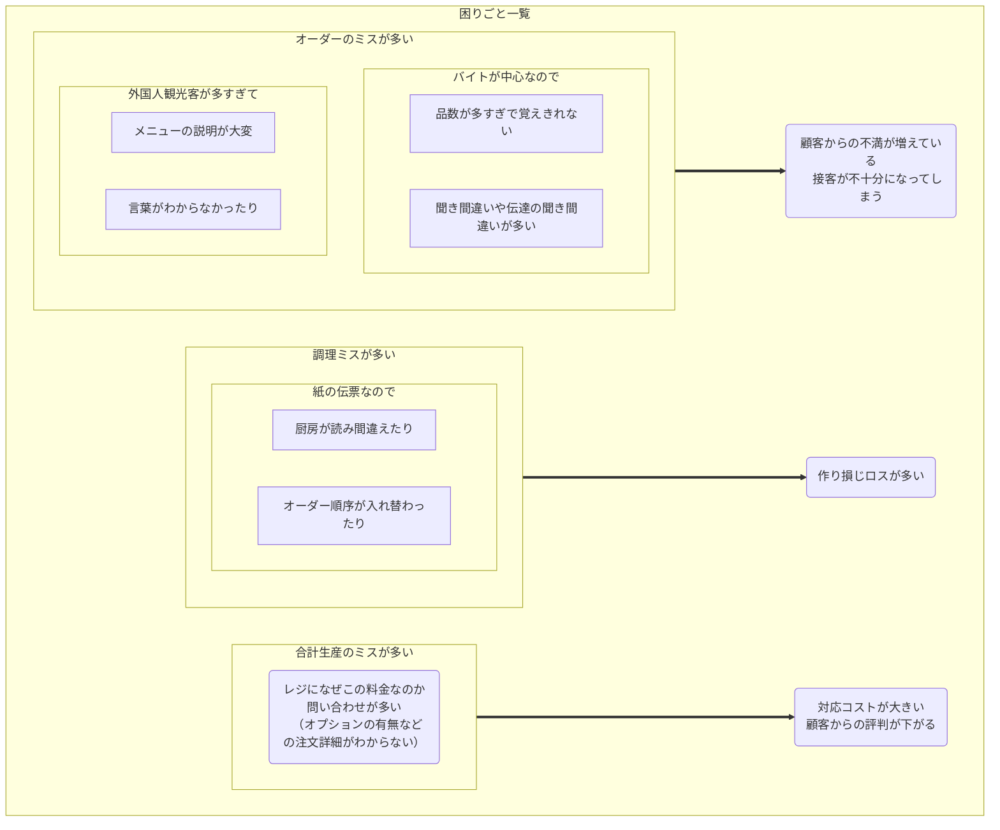

# 要件定義のサンプルケース

### 評判の「目玉焼きハウス」の困りごと
とあるところに、目玉焼き専門店の「目玉焼きハウス」というお店がありました。
いわゆるレストランであり、メニューは目玉焼きのみに特化したシンプルなお店なのですが、創業者であるオーナーのアイデアで考えたレシピが顧客ニーズに上手く刺さったようです。
産地にこだわった新鮮亜卵を生かした絶妙の焼き加減による旨さと、食べるとなぜか頭がスッキリして仕事が捗ることが評判となり、オフィス街を中心に３店舗を経営しています。
最近では、物珍しさから海外からの観光客も増えていて、ますます忙しくなっております。
現場のスタッフはアルバイトが中心であり、全て手作業+紙の伝票などで現場を回しております。

メニューは前述の通り目玉焼きのみなのですが、味付けとして「醤油」、「塩」、「固め」から選ぶことができます。また、焼き加減を「とろとろ」、「半熟」、「普通」、「固め」から指定することができます。
そして通常の「シングル」に加えて、卵を２つ使った「ダブル」、３つ使った「オーズ」の３種類があります。食べ物は目玉焼きのみですが、ソフトドリンクのメニューもあります。

おかげさまで評判が翌来客も奥手繁盛しているのですが、最近になって悩み事が増えていきました。困りごとを整理すると次のようになりました。

### IT化推進のために要望を整理
目玉焼きオーナーはこのままではまずいと考え、IT化をする決断をしました。おりしも時代はAIとのこと。
経営者同士の勉強会などではIoTという言葉も聞いたりします。知り合いのITが得意なコンサルタントはまずオーナーの要望を整理しました。

##### 要望一覧
- スタッフ、ラクラク　顧客、ワクワク！
  - 顧客による直接注文の実現によるオーダーミスの削減
  - 調理指示と注文の自動連動による調理ロスの削減
  - 注文と会計の自動連動による生産ロスの削減

  - 売れ筋・死に筋の把握
  - 店舗環境（近隣イベント、天候や温度）と売り上げや客層の相関分析

  - 店舗での集計ミスなどの防止による管理コストの削減
  - 食材の計画的な発注と食材在庫最小化
  - 売れ行きを鑑みながら、おすすめメニューなどのリアルな投入
  - スタッフの属人化排除
  - 適切な人員配置とローテー＝ションの実現
  - より積極的なマーケティング展開
  - 同業他社とのより一層の差別化
  - 多様な決済方法に対応
etc

しかし、これらを一気にやるのは大変です。そこで色々なやり取りの末に次のような要求を定めました。

### 要求一覧と実現時のイメージ
- タブレット端末を各テーブルに置いて、顧客にセルフサービスで注文をしてもらえるようにしたい。
- 調理場にも大きいタブレット端末を配置して、以下のことをしたい
  - 注文内容の確認
  - 調理の着手
  - 調理の完了・注文の消し込み
- ホール係にスマホ端末を持たせて、以下のことをしたい
  - 調理完了に連動した配膳指示
  - テーブル端末からのスタッフコールの対応
  - 会計終了後のテーブル型付け指示
- 注文と会計の連動

### 要件定義の成果物

コンサルタントはこれらについて検討しながら、具体的に3点セットに落とし込みました。最終的に要件としてオーナーと合意した成果物は次のとおりです。

- 企画書
- 全体図
- ソフトウェアアーキテクチャ
- シナリオ一覧
- ビジネスシナリオ
- アクションシナリオ
- 操作シナリオ
- ワークセット一覧
- UIラフスケッチ
- IFDAM図
- 機能定義書
- ERD

### 情報が足りない
これらは要件定義の成果物、すなわち要件を携えて、コンサルタントは、開発を引き受けてくれることになったびんわねんジニアに相談しました。

敏腕エンジニアが言いました。

- 気持ちは理解した。しかしこのままではまだ実装するための情報が足りない。

ではどうすれば良いか。そうです、システム設計を行うのです。ここからシステム設計が始まります。