# 要件定義のサンプルケース

### 評判の「目玉焼きハウス」の困りごと
とあるところに、目玉焼き専門店の「目玉焼きハウス」というお店がありました。
いわゆるレストランであり、メニューは目玉焼きのみに特化したシンプルなお店なのですが、創業者であるオーナーのアイデアで考えたレシピが顧客ニーズに上手く刺さったようです。
産地にこだわった新鮮亜卵を生かした絶妙の焼き加減による旨さと、食べるとなぜか頭がスッキリして仕事が捗ることが評判となり、オフィス街を中心に３店舗を経営しています。
最近では、物珍しさから海外からの観光客も増えていて、ますます忙しくなっております。
現場のスタッフはアルバイトが中心であり、全て手作業+紙の伝票などで現場を回しております。

メニューは前述の通り目玉焼きのみなのですが、味付けとして「醤油」、「塩」、「固め」から選ぶことができます。また、焼き加減を「とろとろ」、「半熟」、「普通」、「固め」から指定することができます。
そして通常の「シングル」に加えて、卵を２つ使った「ダブル」、３つ使った「オーズ」の３種類があります。食べ物は目玉焼きのみですが、ソフトドリンクのメニューもあります。

おかげさまで評判が翌来客も奥手繁盛しているのですが、最近になって悩み事が増えていきました。困りごとを整理すると次のようになりました。

```mermaid

flowchart
subgraph 困りごと一覧
  オーダーのミスが多い ===> 
  a(
    顧客からの不満が増えている
    接客が不十分になってしまう
  ) 
  調理ミスが多い ===>
  b(
    作り損じロスが多い
  )
  合計生産のミスが多い ===>
  c(
    対応コストが大きい
    顧客からの評判が下がる
  )
end


subgraph オーダーのミスが多い
  バイトが中心なので
  外国人観光客が多すぎて
end

subgraph バイトが中心なので
  品数が多すぎで覚えきれない
  聞き間違いや伝達の聞き間違いが多い
end

subgraph 外国人観光客が多すぎて
  メニューの説明が大変
  言葉がわからなかったり
end

subgraph 調理ミスが多い
  紙の伝票なので
end

subgraph 紙の伝票なので
  厨房が読み間違えたり
  オーダー順序が入れ替わったり
end

subgraph 合計生産のミスが多い
  d(レジになぜこの料金なのか問い合わせが多い
  （オプションの有無などの注文詳細がわからない）)
end




```

